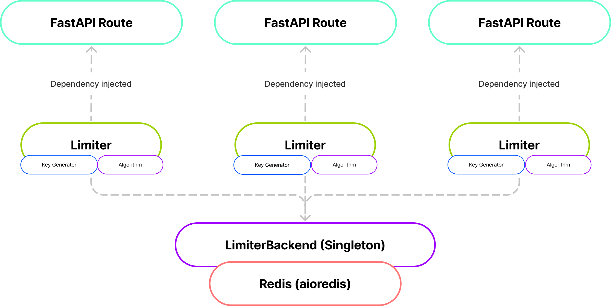

# fastapi-frl
[](https://pypi.python.org/pypi/fastapi-frl)
[](https://pypi.org/project/fastapi-frl/)

Rate limiter library for FastAPI.



## Prerequisite
- Redis server

## Installation
```shell
pip install fastapi-frl
```
## Getting Started

```python3
from fastapi import APIRouter, Depends, FastAPI

from fastapi_frl import LimiterBackend, Limiter
from fastapi_frl.algorithms import SimpleAlgorithm, SlidingWindowCounter
from fastapi_frl.key import KeyByIP, KeyByPath

app = FastAPI()

# You only need to initialize backend of limiter once.
limiter_backend = LimiterBackend('redis://localhost')

# Define the limiter.
limiter = Limiter(
    name='hello_world_limiter',
    algorithm=SimpleAlgorithm(threshold=10),
    key_generator=KeyByIP()
)

# Apply it to a single api endpoint.
@app.get('/', status_code=200, dependencies=[Depends(limiter)])
async def hello_world():
    return {'message': 'Hello World'}

# You can define multiple limiter with different rules.
api_book_limiter = Limiter(
    name='api_book_limiter',
    algorithm=SlidingWindowCounter(10, 10),
    key_generator=KeyByPath(),
)

# Also, you can apply it to the api router.
api_book_router = APIRouter(prefix='/books', tags=['Book'], dependencies=[Depends(api_book_limiter)])

...

app.include_router(api_book_router)

```

## Documentation
The API documentation is in progress.
